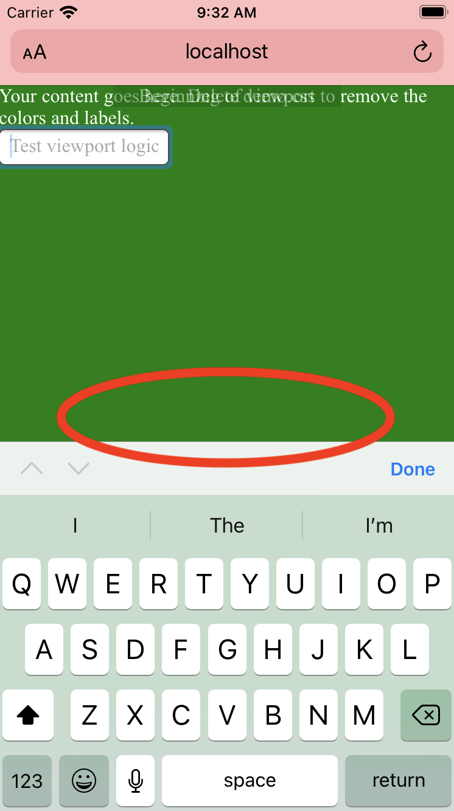

# A Viewport that Works

## Problem

CSS provides easy ways to measure content on screen according to the viewport, but some browsers and some devices don't quite behave the way you'd expect.

### Example
Notice the "end of viewport" label at the bottom.

Once we toggle the Safari keyboard, the viewport calculation does not take into account the space obscured by the keyboard.

