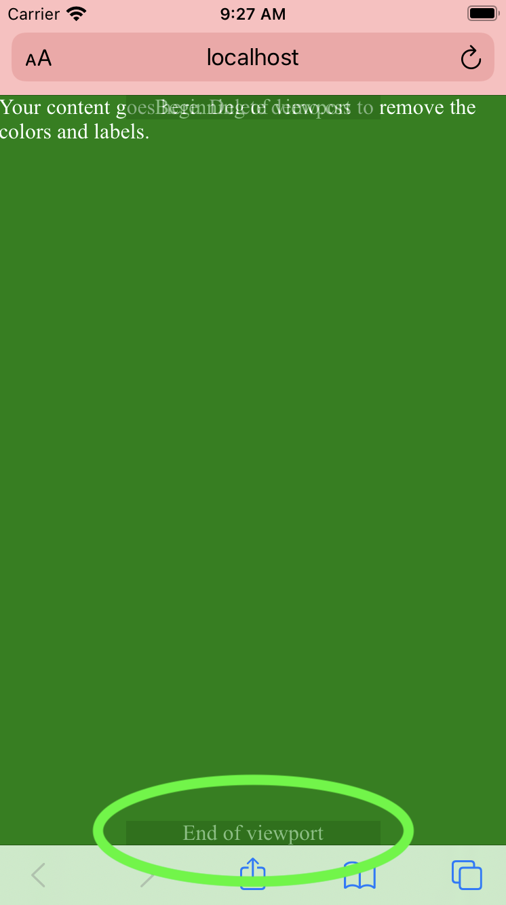
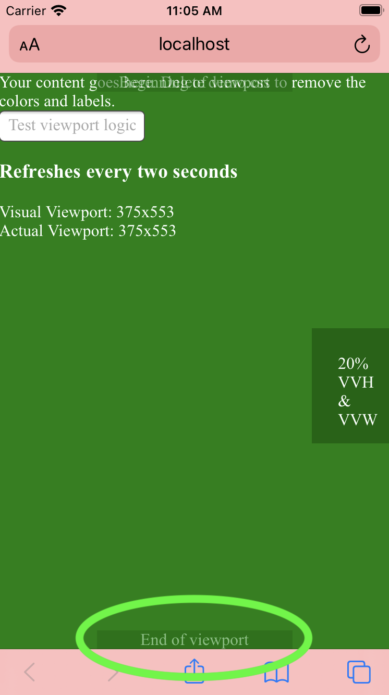

# A Viewport that Works

 

## Problem

CSS provides easy ways to measure content on screen according to the viewport, but some browsers and some devices don't quite behave the way you'd expect.

### Example ([Demo](https://adamjgrant.github.io/a-viewport-that-works/))

#### Keyboard closed
Notice the "end of viewport" label at the bottom.

 

#### Keyboard open
Once we toggle the Safari keyboard, the viewport calculation does not take into account the space obscured by the keyboard.

 

With A Viewport that Works, we can fix this instantly with very little CSS and JavaScript

#### Keyboard closed

 

#### Keyboard open

 

# Installation

## Quickstart

Copy `index.html` and delete these lines

~~~html
<!-- To use this HTML file in a real project, remove these lines. -->
<link rel="stylesheet" href="css/demo.css">

~~~

You'll now have a blank canvas like this:

 

Now just treat `

` as if it were the `<body>` tag.

## From scratch

In an existing HTML file, you'll need the following:

1. Import normalize and viewport-fix.css in the `<head>`

   ~~~html
   <link rel="stylesheet" href="css/normalize.css">
   <link rel="stylesheet" href="css/viewport-fix.css">
   ~~~

2. `

` Directly under the `<body>` tag.
3. Import and instantiate viewport-fix.js

   ~~~html
   
   
   ~~~
   
Now just treat `

` as if it were the `<body>` tag.

# How to use

## Viewport Measurements

Use the CSS variables `--100vvh` and `--100vvw` in place of `100vh` and `100vw` respectively.
I recommend passing in the native `100vh` or `100vw` as the fallback value. This will allow
the browser to use the regular viewport height/width for the split second until the visual
viewport has done its initial calculation.

#### Example

~~~css
.sidebar {
  height: var(--100vvh, 100vh);
}
~~~

For partial measurements, use `calc()` with a decimal value.

#### Example

Instead of

~~~css
.button { 
  height: 20vh;
}
~~~

...do this

~~~css
.button {
  height: calc(var(--100vvh, 100vh) * 0.2);
}
~~~

## Positioning

### Absolute

`

` is meant to work as if it were the `<body>` of the document.
As such, viewport-fix.css sets it as `position: relative` and `overflow: auto`.

This means as long as elements are in `#viewport` with no relative positioned elements
in between, you can simply `absolute` position your elements as you would in
`<body>`.

#### Example

~~~css
.bottom-menu-bar {
  position: absolute;
  bottom: 0;
  left: 0;
  right: 0;
}
~~~

### Fixed

Fixed positioning is a little different, so the values `--offset-h` and `--offset-w` are provided.

#### Example

Instead of

~~~css
.sticky-bottom-menu-bar {
  position: fixed;
  left: 0;
  right: 0;
  bottom: 0;
}
~~~

...do this

~~~css
.sticky-bottom-menu-bar {
  position: fixed;
  left: 0;
  right: 0;
  bottom: var(--offset-h, 0);
}
~~~

#### Example with offset

If a nonzero number is required, again, just use CSS `calc()`

Instead of

~~~css
.sticky-bottom-menu-bar {
  position: fixed;
  left: 0;
  right: 0;
  bottom: 20px;
}
~~~

...do this

~~~css
.sticky-bottom-menu-bar {
  position: fixed;
  left: 0;
  right: 0;
  bottom: calc(var(--offset-h, 0) + 20px);
}
~~~

# How does it work?

In order to use as little JavaScript as possible, we listen to the new `window.visualViewport` 
`resize()` event and pull from the `visualViewport` height and width.

To let you keep writing CSS, these values are written into the DOM in a style tag as so:

~~~html

~~~

By simply using native CSS functions for variables and calculation, the CSS will
automatically respect these values in place of `vh` and `vw`.